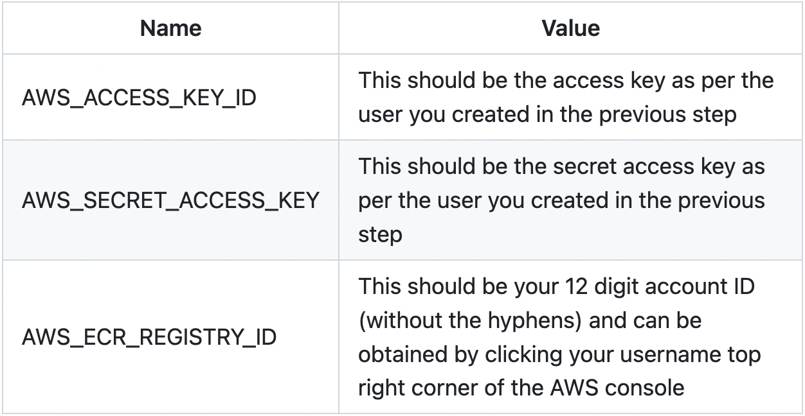
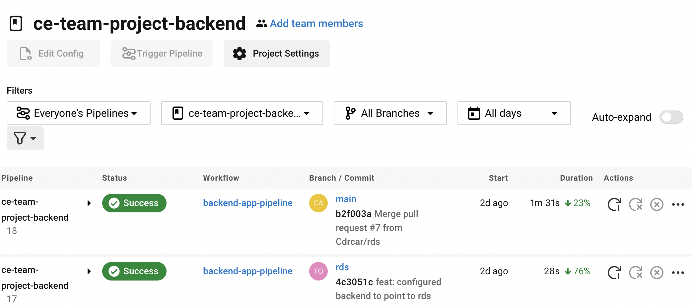
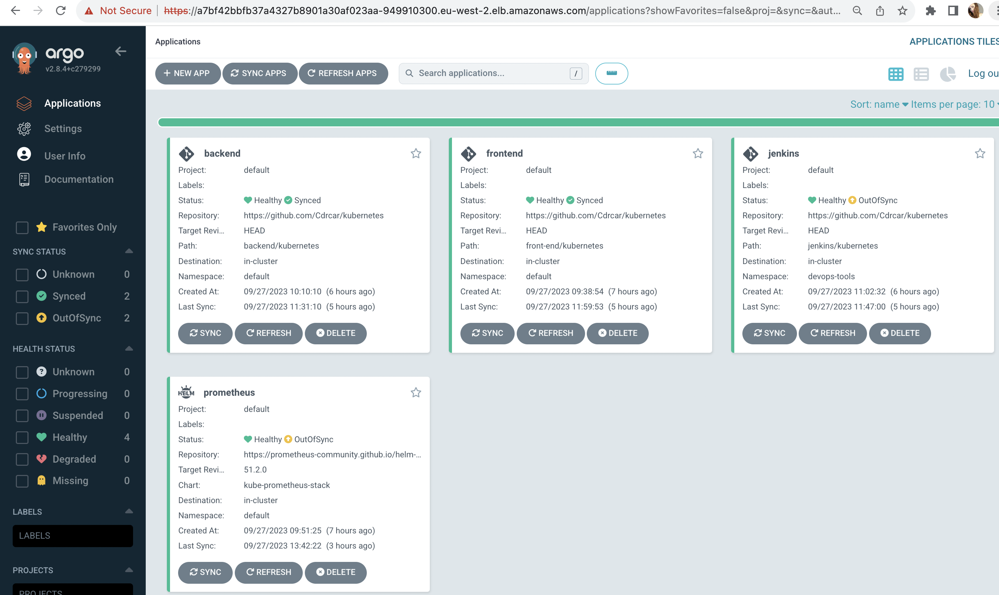
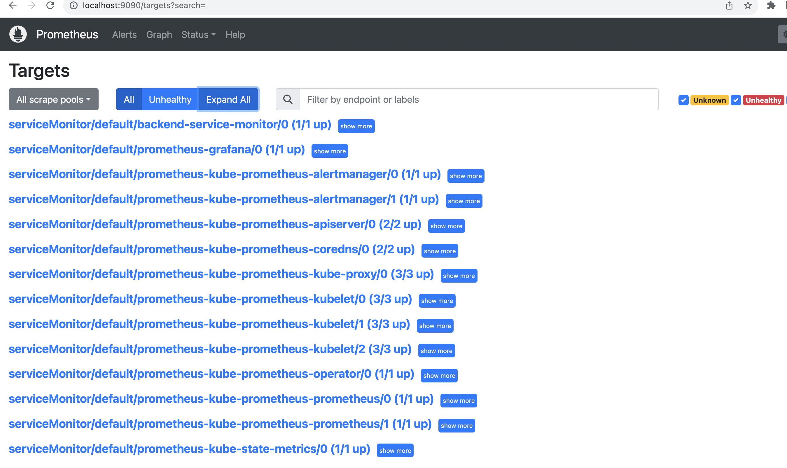
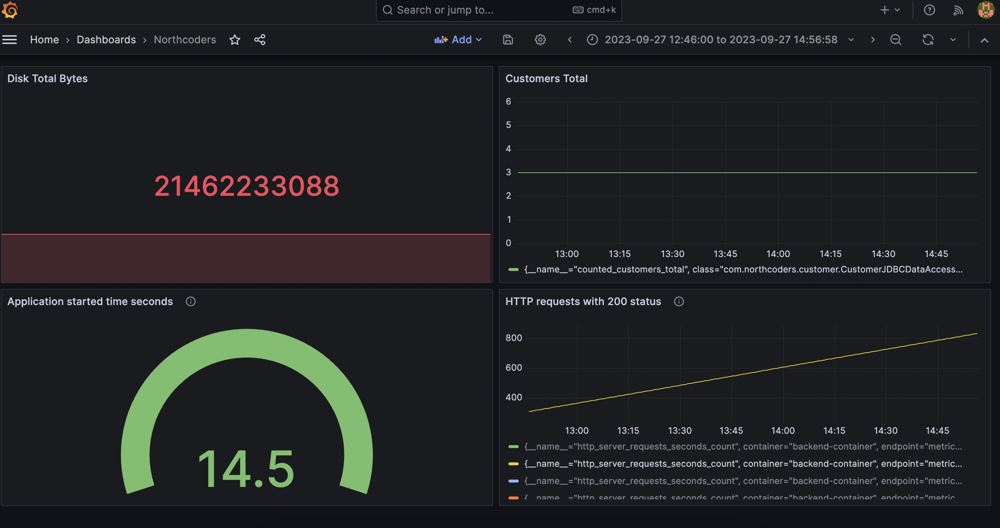
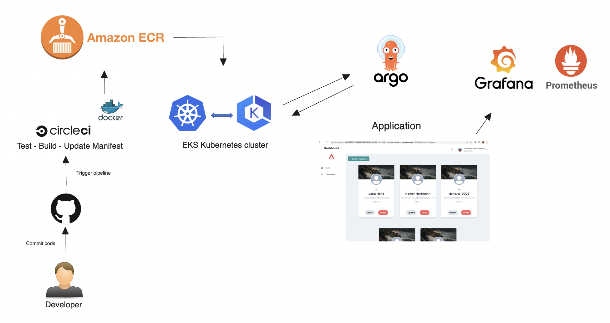
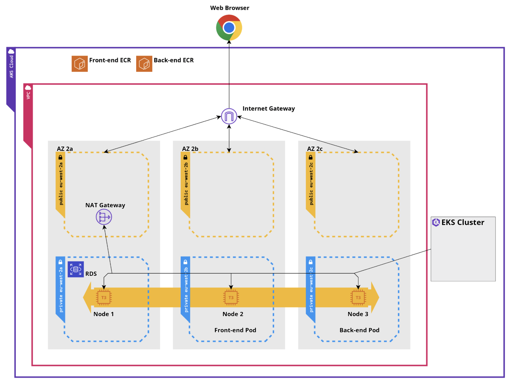

# Cloud Engineering Team Project

## [Table of Contents](#table-of-contents)

- [Overview](#overview)
- [Objective](#objective)
- [Technologies Used](#technologies-used)
- [Infrastructure Overview](#infrastructure-overview)
- [CI CD](#ci-cd)
- [GitOps with ArgoCD](#gitops-with-argocd)
- [Monitoring and Metrics](#monitoring-and-metrics)
- [Future Improvements](#future-improvements)
- [How to Recreate the Environment](#how-to-recreate-the-environment)
- [Final result](#final-result)
- [License](#license)
- [Contact Me](#contact)

## [Overview](#overview)

This repository contains the infrastructure as code (IaC), configuration files, and documentation for the deployment of the Northcoders learner management system to AWS cloud. The project involved the deployment of both the frontend and backend applications, along with supporting services such as a container registry, Kubernetes cluster, and a relational database.

## [Objective](#objective)

The primary objective of this project was to deploy the learner management system and its supporting services to AWS cloud. The team aimed to leverage DevOps principles, automate CI/CD pipelines, and create a robust and scalable infrastructure.

## [Technologies Used](#technologies-used)

- AWS (Amazon Web Services)
- Terraform for Infrastructure as Code (IaC)
- Kubernetes (EKS - Elastic Kubernetes Service)
- Docker for containerization
- CircleCI for continuous integration and continuous deployment (CI/CD)
- ArgoCD for GitOps-based application deployment
- Prometheus and Grafana for monitoring and metrics

## [Infrastructure Overview](#infrastructure-overview)

### AWS Services Utilised

- **Amazon Elastic Container Registry (ECR):** Used for container image storage.
- **Elastic Kubernetes Service (EKS):** Managed Kubernetes cluster for container orchestration.
- **Amazon RDS (Relational Database Service):** A managed PostgreSQL database used by the backend.

### Infrastructure as Code (Terraform)

We used Terraform to provision and manage the AWS infrastructure. The IaC scripts are organized into modules and include:

- **VPC:** Virtual Private Cloud with both public and private subnets.
- **EKS Cluster:** Kubernetes cluster with node groups.
- **Security Groups:** Network security rules for resources.
- **RDS Instance:** PostgreSQL database with encryption.
- **Load Balancers:** For frontend and backend services.
- **IAM Roles and Policies:** For access control.

## [CI CD](#ci-cd)

- **CircleCI:** We set up automated CI/CD pipelines for both frontend and backend repositories on GitHub. These pipelines build, test, and deploy the applications.

## [GitOps with ArgoCD](#gitops-with-argocd)

- **ArgoCD:** We adopted a GitOps approach to application deployment using ArgoCD. Our Kubernetes manifests are stored in Git repositories, and ArgoCD ensures that the clusters reflect the desired state.

## [Monitoring and Metrics](#monitoring-and-metrics)

- **Prometheus and Grafana:** We implemented monitoring and metrics using Prometheus for data collection and Grafana for visualizing metrics through dashboards.

## [Future Improvements](#future-improvements)

We plan to improve in the future:

- Enhanced Monitoring: Implement more advanced alerting and anomaly detection.
- Security Enhancements: Implement stricter IAM roles and security policies.
- Scalability: Optimize the infrastructure for auto-scaling based on traffic.
- Backup and Disaster Recovery: Implement automated backup and recovery procedures.
- Apply other technologies like Jenkins.

## [How to Recreate the Environment](#how-to-recreate-the-environment)

To recreate this environment, follow the step-by-step instructions provided below. Ensure that you have the required [AWS credentials](https://eu-west-2.signin.aws/platform/login?workflowStateHandle=2a98028d-0a9d-4837-b6a4-597fcec3b07a), [Terraform](https://developer.hashicorp.com/terraform/tutorials/aws-get-started/install-cli), [kubectl](https://kubernetes.io/docs/tasks/tools/), and other dependencies installed.

1. **Clone this repository**

`git clone https://github.com/Cdrcar/Northcoders-Cloud-Project.git`

2. **Create AWS Resources**

Navigate to the Terraform directory and initialize Terraform:

`terraform init`

Next, review and customize the variables.tf file to suit your requirements. Pay attention to variables like aws_region, aws_access_key, and aws_secret_key.

Now, apply the Terraform configuration to create AWS resources:

`terraform plan`

`terraform apply`

3. **Connect to the EKS Cluster: Use kubectl to configure and connect to your EKS cluster**

`aws eks update-kubeconfig --name <cluster-name> --region <region>`

You can verify that kubectl is correctly configured to use your EKS cluster by running the following command:

`kubectl config current-context`

4. **Build and Push Docker Images to AWS ECR Manually**(follow commands indicated in the ECR push commands):

Navigate to frontend-app and backend-app  and build Docker images. Replace [version] with the desired version number:

`docker build -t <your-image-name>:[version] .`

Tag the Docker Image:

`docker tag <your-image-name>:<image-version> <your-account-id>.dkr.ecr.<your-region>.amazonaws.com/<repository-name>:<image-version>
`

Log in to ECR: Run the following command to authenticate your Docker CLI to your ECR registry:

`aws ecr get-login-password --region <your-region> | docker login --username AWS --password-stdin <your-account-id>.dkr.ecr.<your-region>.amazonaws.com
`

Push the Docker Image to ECR:

`docker push <your-account-id>.dkr.ecr.<your-region>.amazonaws.com/<repository-name>:<image-version>
`

5. **CircleCI**

You can replace step 4 Accessing [CircleCi](https://github.com/Cdrcar/ce-cicd-sample-java-app)

- CircleCI Dashboard: After running terraform apply and successfully deploying your infrastructure and applications, you can access the CircleCI dashboard. CircleCI provides continuous integration and delivery (CI/CD) capabilities for your project.

- Access URL: Open your web browser and navigate to the CircleCI dashboard using the following URL: https://circleci.com/.

- Log In: If you have an existing CircleCI account, log in using your credentials. If not, you can create a new account using your github account.

- Project Integration: Once logged in, you should see the project integrated with CircleCI. CircleCI will automatically detect your repository and set up CI/CD pipelines.

- Setup CircleCI environment variables: Navigate to the project and click the Project Settings button in the top right corner. Then click Environment Variables. You are going to setup three environment variables:

- Pipeline Execution: You can monitor the execution of your CI/CD pipelines, view build logs, and access artifacts generated during the build process.

6. **ArgoCD**

[Create ArgoCD Namespace](https://github.com/Cdrcar/ce-gitops-argocd): Once you have your Docker image in ECR and you're connected to the EKS cluster, you can create the ArgoCD namespace and deploy ArgoCD. Here's a general sequence of steps:

- Create Namespace:

`kubectl create namespace argocd`

- Then apply the YAML files associated with Argo:

`kubectl apply -n argocd -f https://raw.githubusercontent.com/argoproj/argo-cd/stable/manifests/install.yaml`

- You can see if your ArgoCD pods deployed by running:

`kubectl get pods -n argocd`

- Obtaining the ArgoCD password:

`kubectl -n argocd get secret argocd-initial-admin-secret -o jsonpath="{.data.password}" | base64 -d`

- Port forwarding to access ArgoCD locally:

`kubectl port-forward svc/argocd-server -n argocd 8080:443`

- If you prefer to [access ArgoCD remotely](https://github.com/Cdrcar/ce-team-project/blob/main/argocd-on-eks.md):

`kubectl edit svc argocd-server -n argocd`

This will open the argo-server service manifest file, at the bottom of spec type should be changed from ClusterIP to LoadBalancer.

- Run `kubectl get svc -n argocd` to list the services in the argocd namespace. You can then use the EXTERNAL-IP for argo-server to access the ArgoCD web app and login using the username admin and the password obtained in the previous step.

- Application Management: Once logged in, you'll have access to the ArgoCD dashboard, where you can manage and deploy your applications. 

- Continuous Deployment: ArgoCD will automatically sync with your Git repository and deploy any changes made to your application code. You can also manually trigger deployments and monitor their status.

7. **Prometheus**

- Follow the instructions of the Prometheus and Grafana repository: https://github.com/Cdrcar/ce-prometheus-grafana

- Deploy a prometheus application using ArgoCD.

- The kubernets/backend directory contains the service-monitor.yaml file that specifies the targets and scrape intervals for collecting metrics.

- Verify Deployment: Confirm that Prometheus has been deployed by running:

`kubectl get pods`

- Access Prometheus UI: You can access the Prometheus UI via a port-forward command:

`kubectl port-forward svc/prometheus-operated 9090:9090`

Or edit the manifest file adding a LoadBalancer type and then running kubectl get services and accessing the EXTERNAL-IP of prometheus-operated. 

- Access Prometheus: Open a web browser and navigate to http://localhost:9090 (if using port forwarding) or the appropriate service URL to access the Prometheus UI. You can check the targets where you should be able to see the ServiceMonitor "backend-service-monitor".

8. **Grafana**

- Run command `kubectl get pods`

- Access Grafana UI: You can access the Grafana UI via a port-forward command:

`kubectl port-forward svc/prometheus-grafana 8082:80`

Or edit the manifest file adding a LoadBalancer type and then running kubectl get services and accessing the EXTERNAL-IP of prometheus-grafana. This will allow you accesing Grafana remotely from the EKS cluster.

- Access Grafana: Open a web browser and navigate to http://localhost:8082 (if using port forwarding) or the appropriate service URL to access the Prometheus UI. The user name is `admin` and the password `prom-operator`.

- Grafana is a powerful observability and visualization platform that allows you to do several important things in the context of monitoring and observability: Data visualization, real time monitoring, alerting, data sourcess (supports various data sources, including popular databases like Prometheus, InfluxDB, Elasticsearch, and many more), etc.

## [Final result](#final-result)

CircleCI 

ArgoCD

Prometheus

Grafana

Continuos Integration - Continuos Development 

AWS Infrastructure

## [Contact](#contact)

If you have any questions or need further information, feel free to reach out to our team:

- [Tom Wroe](https://github.com/Hyzad)
- [Carmela Rey](https://github.com/cdrcar)
- [Manal Abdulqawi](https://github.com/ManalAbdulqawi)
- [Luis Fifield](https://github.com/LouisFifield)

Thank you for your interest in our Cloud Engineering Team Project!
